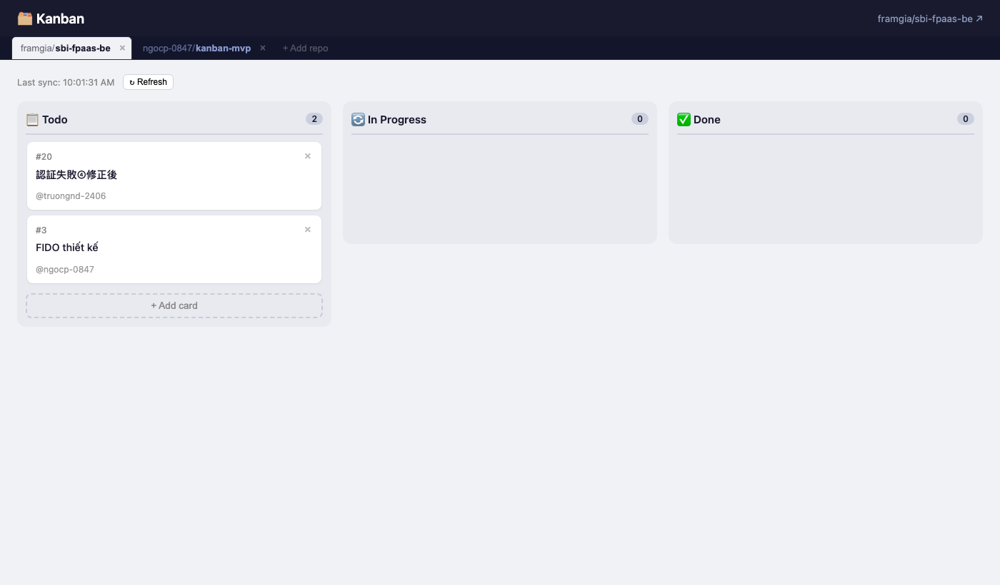
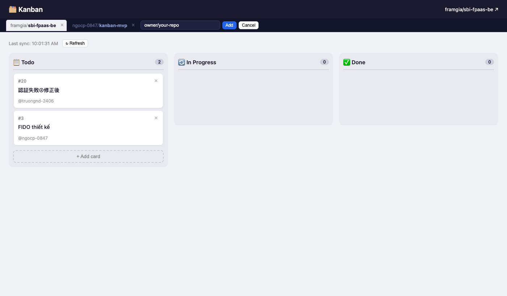
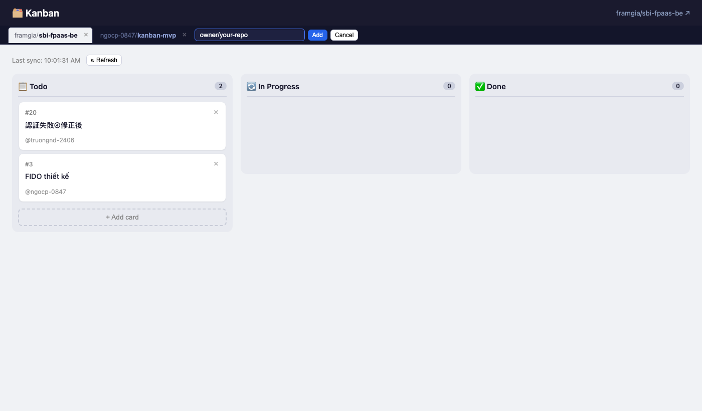
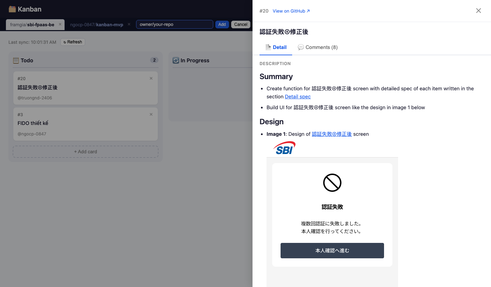
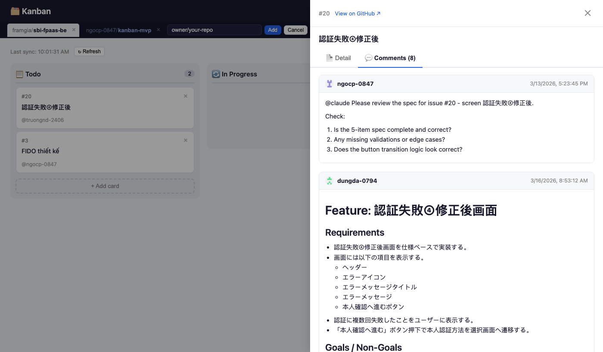
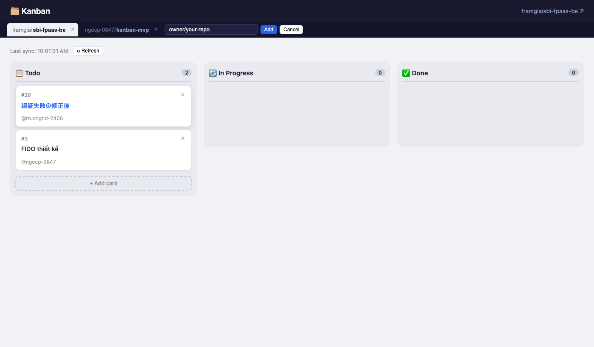

# 🗂 Kanban MVP

> A minimal Kanban board with **2-way GitHub Issues sync** — manage issues across multiple repos visually, without leaving the browser.



---

## ✨ Features

| Feature | Description |
|---|---|
| 📋 **Kanban board** | Drag & drop cards across Todo / In Progress / Done |
| 🔄 **2-way GitHub sync** | Changes reflect on GitHub in real-time (labels) |
| 🗂 **Multi-repo** | Add, switch, and remove multiple repos in one board |
| 📄 **Issue detail** | Full markdown body, mermaid diagrams, assignees, labels |
| 💬 **Comments** | Read and post comments directly from the board |
| 📡 **Live updates** | SSE + 30s polling — board stays in sync automatically |

---

## 🖥 Screenshots

### Board — multi-repo tabs



Switch between repos using the tab bar. Each repo polls GitHub independently.

---

### Add a repo



Paste `owner/repo` or a full GitHub URL. The board validates the repo exists before adding it.

---

### Issue detail — Description



Full **Markdown** rendering — tables, code blocks, inline images. **Mermaid** diagrams render as SVG automatically.

---

### Issue detail — Comments



View all comments and post new ones with Markdown support — without leaving the board.

---

### Card hover



Drag any card to change its GitHub label. Click the title to open the detail panel.

---

## 🚀 Quick Start

```bash
# 1. Clone
git clone https://github.com/ngocp-0847/kanban-mvp.git
cd kanban-mvp

# 2. Install
npm install
cd client && npm install && cd ..

# 3. Configure
cp .env.example .env
# → edit .env: set GITHUB_TOKEN (needs repo scope)

# 4. Run
node server/index.js &        # API + poller on :4000
cd client && npx vite          # Frontend on :5173
```

Open **http://localhost:5173**, then click **+ Add repo** to add your first GitHub repo.

---

## ⚙️ Configuration

```env
# .env
GITHUB_TOKEN=ghp_your_personal_access_token   # repo scope required
GITHUB_OWNER=your-username                    # seeded as first repo
GITHUB_REPO=your-repo-name
PORT=4000
```

Generate a token at → https://github.com/settings/tokens (scopes: `repo`)

---

## 🏗 Architecture

```
┌─────────────────────────────────────────────────────────────────┐
│  Browser (React + Vite)                                         │
│  ┌──────────┐  ┌──────────────┐  ┌────────────────────────┐    │
│  │ RepoTabs │  │ Kanban Board │  │ Issue Detail Panel     │    │
│  │ add/rm   │  │ drag & drop  │  │ markdown + mermaid     │    │
│  └────┬─────┘  └──────┬───────┘  │ comments + assignees  │    │
│       │               │           └────────────────────────┘    │
│       └───────────────┴──── SSE ──────────────────────────────  │
└───────────────────────────────────────────────────────────────-─┘
                              │
┌─────────────────────────────▼───────────────────────────────────┐
│  Express Server (Node.js)                                       │
│  /api/repos      CRUD repo list → repos.json                    │
│  /api/repos/:o/:r/issues  ← GitHub REST API                     │
│  /api/events     SSE stream (per-repo broadcasts)               │
│  Poller          30s interval per repo → state diff → SSE push  │
└───────────────────────────────────────────────────────────────-─┘
                              │
               ┌──────────────▼───────────────┐
               │  GitHub REST API v2022-11-28  │
               │  Issues · Labels · Comments   │
               │  Collaborators · Assignees    │
               └──────────────────────────────┘
```

### How columns map to GitHub labels

| Column | GitHub Label | Color |
|---|---|---|
| 📋 Todo | `kanban:todo` | 🟡 |
| 🔄 In Progress | `kanban:in-progress` | 🔵 |
| ✅ Done | `kanban:done` | 🟢 |

Labels are **auto-created** on the repo when you add it. Issues without kanban labels default to **Todo**.

---

## 📡 API Reference

| Method | Endpoint | Description |
|---|---|---|
| `GET` | `/api/repos` | List saved repos |
| `POST` | `/api/repos` | Add repo `{owner, repo}` |
| `DELETE` | `/api/repos/:owner/:repo` | Remove repo |
| `GET` | `/api/repos/:o/:r/issues` | List open issues |
| `POST` | `/api/repos/:o/:r/issues` | Create issue |
| `PATCH` | `/api/repos/:o/:r/issues/:id/move` | Move to column |
| `PATCH` | `/api/repos/:o/:r/issues/:id/close` | Close issue |
| `GET` | `/api/repos/:o/:r/issues/:id/comments` | Get comments |
| `POST` | `/api/repos/:o/:r/issues/:id/comments` | Post comment |
| `GET` | `/api/events?repo=owner/repo` | SSE stream |

---

## 🛠 Built With

- [React 18](https://react.dev) + [Vite](https://vitejs.dev)
- [@hello-pangea/dnd](https://github.com/hello-pangea/dnd) — drag and drop
- [marked](https://marked.js.org) — markdown rendering
- [mermaid](https://mermaid.js.org) — diagram rendering
- [Express](https://expressjs.com) — API server
- [GitHub REST API](https://docs.github.com/en/rest) — data source

---

*Built using [gstack](https://github.com/garrytan/gstack) — Garry Tan's Claude Code setup*
