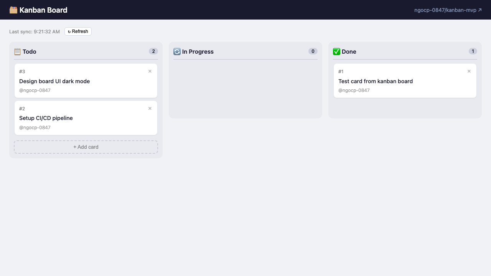

# 🗂 Kanban MVP — GitHub Issues 2-Way Sync

A minimal Kanban board that syncs bidirectionally with GitHub Issues.



## How It Works

- **Cards = GitHub Issues**
- **Columns = Labels**: `kanban:todo` / `kanban:in-progress` / `kanban:done`
- Drag a card → updates the issue label on GitHub
- Create a card → creates a new GitHub Issue
- Close a card → closes the issue on GitHub
- Auto-syncs from GitHub every 30s via SSE (Server-Sent Events)

## Stack

| Layer | Tech |
|---|---|
| Frontend | React 18 + Vite + @hello-pangea/dnd |
| Backend | Express.js + node-fetch |
| Sync | GitHub REST API + SSE polling (30s) |
| Auth | GitHub Personal Access Token |

## Quick Start

```bash
# 1. Clone
git clone https://github.com/ngocp-0847/kanban-mvp.git
cd kanban-mvp

# 2. Install dependencies
npm install
cd client && npm install && cd ..

# 3. Configure
cp .env.example .env
# Edit .env: add GITHUB_TOKEN, GITHUB_OWNER, GITHUB_REPO

# 4. Run
node server/index.js &        # API server on :4000
cd client && npx vite          # Frontend on :5173
```

Open `http://localhost:5173`

## Environment Variables

```env
GITHUB_TOKEN=ghp_your_token_here
GITHUB_OWNER=your-username
GITHUB_REPO=your-repo-name
PORT=4000
```

## API Endpoints

| Method | Path | Description |
|---|---|---|
| `GET` | `/api/issues` | List all Kanban issues |
| `POST` | `/api/issues` | Create issue (→ kanban:todo) |
| `PATCH` | `/api/issues/:id/move` | Move to column (label swap) |
| `PATCH` | `/api/issues/:id/close` | Close issue on GitHub |
| `GET` | `/api/events` | SSE stream for real-time updates |

## Architecture

```
User drags card → PATCH /api/issues/:id/move
  → Remove old kanban:* label
  → Add new kanban:* label
  → GitHub API updates issue

Poller (30s) → GET GitHub issues with kanban:* labels
  → Detect changes
  → Broadcast via SSE → Frontend updates board
```

## Built With

[gstack](https://github.com/garrytan/gstack) — Garry Tan's Claude Code setup
